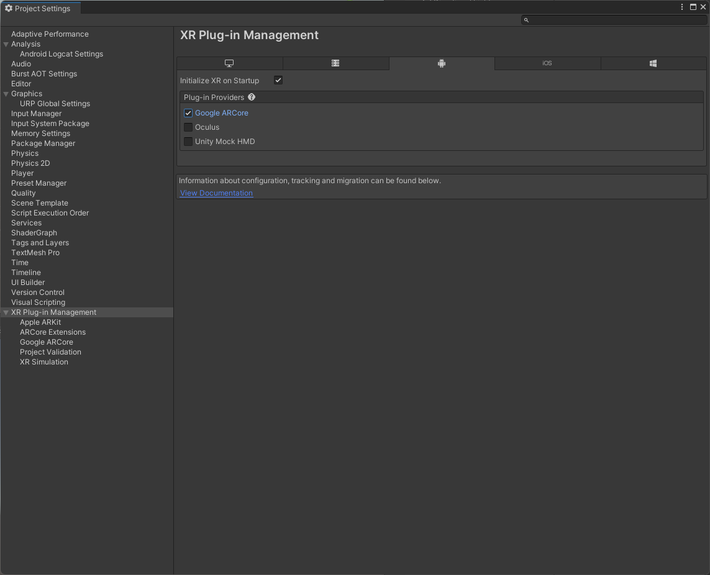
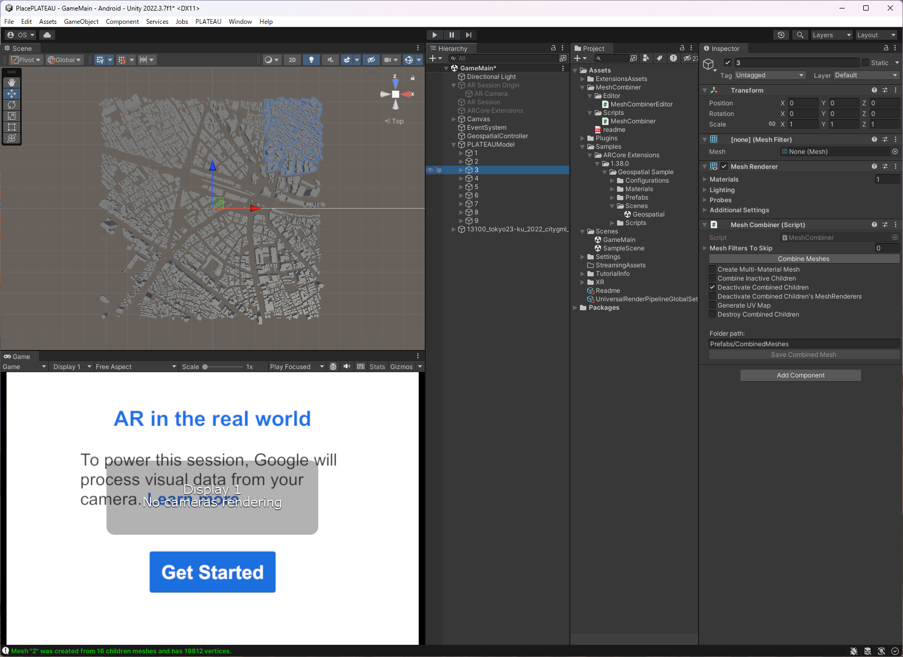
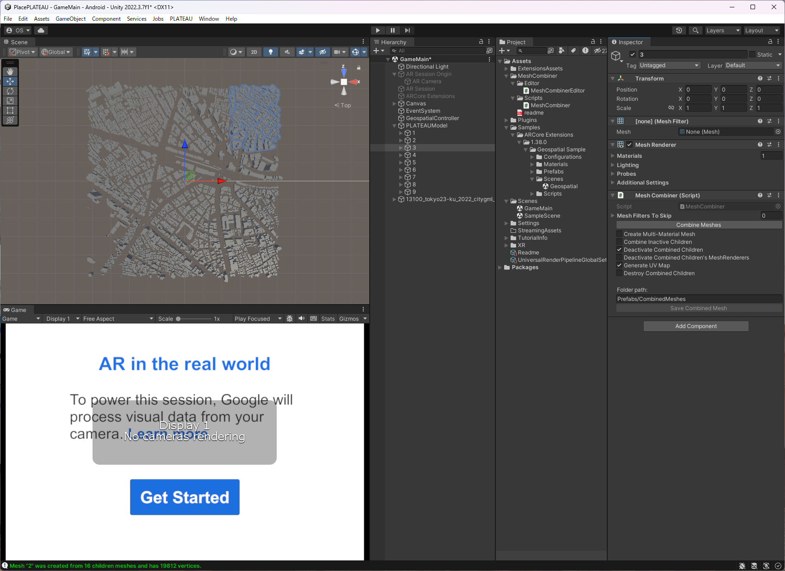

# Topic XX 3D都市モデルと位置情報をUnityで扱う

PLATEAUは他のさまざまな位置情報と組み合わせて使うことで、さらに多くの活用が考えられます。本トピックでは22年度チュートリアルのTopic14の発展として、スマートフォンのGPSによる位置情報など、座標系の違う位置情報をPLATEAUと重ね合わせて表示するARアプリの開発を通して、PLATEAUを他の位置情報と合わせて使う方法について説明します。

## 3D都市モデルを読み込む

最初に、PLATEAU SDK for Unityを使ってPLATEAUの3D都市モデルをUnityに読み込みます。この時、ファイルの扱い方、ツールの利用方法、どのような座標系で読み込まれるかなど、重ね合わせるためのポイントを確認します。

本チュートリアルでは、なるべく実際の処理の内容を詳細に記載するようにしています。
<!-- 素でべたに０→１で書くようにしているけど、便利なライブラリもあるから探してみてね的なことを書きたい。後ほど考える -->
ですが、便利なライブラリなどもありますので、自分が読み込みたいデータに対応したライブラリなどを探してみてください。

### PLATEAU SDK for Unityを使ってデータを読み込む

[PLATEAU SDK for Unity](https://github.com/Project-PLATEAU/PLATEAU-SDK-for-Unity)を使って、PLATEAUの3D都市モデルをUnityに読み込みます。SDKについての詳細は、PLATEAU公式サイトのチュートリアルでも解説されています。詳細はそちらも参照してください。[TOPIC 17｜PLATEAU SDKでの活用[1/2]｜PLATEAU SDK for Unityを活用する](https://www.mlit.go.jp/plateau/learning/tpc17-1/)
また、GitHubのリポジトリのReadmeやマニュアルも参考にしてください。

今回は、Unity 2021.3.16f1を使用して進めていきます。.16f1などのマイナーバージョンはあまり気にしなくてよいと思いますが、PLATEAU SDK for Unityが現在Unityバージョン2021.3を想定しているので、2021.3系列を使用するとよいでしょう。

SDKのマニュアルなどにしたがって、新規プロジェクトを作成しSDKを導入します。

この際、読み込む座標系を確認します。PLATEAU SDK for Unityでは、インポート時に平面直角座標系に変換するようになっています。平面直角座標系は日本固有の投影座標系で、日本全国を19のゾーンに分け、ガウスの等角投影法を適用した座標系です。
そのため、これから作るアプリでは最終的に平面直角座標系に変換することで、PLATEAUの3D都市モデルと合わせていきます。

<!-- 
SDKで読み込む方法の紹介と、その際の座標変換の確認
平面直角座標系
中心点のオフセットの確認と、オフセット値のJGD2011への変換
-->

## さまざまな地理情報を重ねる

次に、座標変換の方法を説明します。実際に座標変換の式をプログラムにして、変換を確認します。また、GPSのデータやオープンデータの変換を行います。

### 座標計算の一般的な注意

緯度経度の座標から、平面直角座標系の座標に変換するプログラムを作成します。変換式は国土地理院が公開しているので、それをプログラムに落とし込みます。
一般的な注意点ですが、地理座標を扱うプログラムでは数値計算の誤差に注意します。とくに、地球規模の座標計算をする場合、たとえば地球の周囲長は約4万㎞なので、メートルで記述すると約40,000,000mとなります。また、コンピューターが扱う浮動小数点規格の標準であるIEEE754を参照すると、一般的にfloatとして知られる32ビットの単精度浮動小数点の形式では実際の数字を現す仮数部が23ビットとなり、10進数でおよそ7桁の数字を表現できます。つまり、地球の周囲長と比べてみると上から数えて10mの位までしか表現できません。地球規模の座標の演算を行う際にfloatを使うと、10m以下の数字は計算されないことになり、大きく精確性が落ちます。
一方で、Unityなどの3Dコンピュータグラフィックスを描画するプログラムは、一般的に高速化のためfloatで座標を表します。
こうした違いのため、座標変換のプログラム内では倍精度浮動小数であるdoubleで計算し、扱いやすい局所的な座標に計算してからfloatにキャストしてUnityなどに渡す、という方法をとるのがよいでしょう。

### 平面直角座標系への変換

平面直角座標系への変換は、ガウス＝クリューゲル変換として知られる計算を行います。国土地理院のWebに、[測量計算サイト](https://vldb.gsi.go.jp/sokuchi/surveycalc/main.html)というページがあり、ここでよく使う計算についてWebページ上で計算できる仕組みが用意されています。また、それぞれの計算式やアルゴリズムが解説されています。


ここの計算式を使って、緯度経度から平面直角座標系に変換するプログラムを作成してみましょう。
[平面直角座標への換算](https://vldb.gsi.go.jp/sokuchi/surveycalc/surveycalc/bl2xyf.html)のページの上段に、計算式というリンクがあり、


そこから計算式を確認できます。


今回は、Unityなので、C#でこの計算式をプログラムに落とし込みます。

ここでは、座標変換のクラスは、UnityのMonoBehaviorを継承する必要がないので、素のクラスとして記述します。また、状態を持つ必要がないので、変換メソッドはstaticとして実装します。サンプルでは座標の2つの値を返すのにタプルを使っていますが、ここも必要に応じて設計を変えるとよいでしょう。（ここはどのように使うかを想定して各自で設計を考えてみてください。）

以下が緯度経度と平面直角座標系の変換プログラムのサンプルです。

```csharp:CoordinateUtil.cs
using System;

public class CoordinateUtil
{
    // GRS80 Ellipsoid
    private const double a = 6378137d;
    private const double F = 298.257222101d;

    // 平面直角座標系のX軸上における縮尺係数
    private const double m0 = 0.9999d;

    private const double n = 1d / (2d * F - 1d);

    // Geographic -> Plane Rectangular
    private const double a1 = 1d * n / 2d - 2d * n * n / 3d + 5d * n * n * n / 16d + 41d * n * n * n * n / 180d - 127d * n * n * n * n * n / 288d;
    private const double a2 = 13d * n * n / 48d - 3d * n * n * n / 5d + 557d * n * n * n * n / 1440d + 281d * n * n * n * n * n / 630d;
    private const double a3 = 61d * n * n * n / 240d - 103d * n * n * n * n / 140d + 15061d * n * n * n * n * n / 26880d;
    private const double a4 = 49561d * n * n * n * n / 161280d - 179d * n * n * n * n * n / 168d;
    private const double a5 = 34729d * n * n * n * n * n / 80640d;

    private const double A0 = 1d + n * n / 4d + n * n * n * n / 64d;
    private const double A1 = -3d / 2d * (n - n * n * n / 8d - n * n * n * n * n / 64d);
    private const double A2 = 15d / 16d * (n * n - n * n * n * n / 4d);
    private const double A3 = -35d / 48d * (n * n * n - 5d * n * n * n * n * n / 16d);
    private const double A4 = 315d * n * n * n * n / 512d;
    private const double A5 = -693d * n * n * n * n * n / 1280d;

    // Plane Rectangular -> Geographic
    private const double b1 = n / 2d - 2d * n * n / 3d + 37d * n * n * n / 96d - n * n * n * n / 360d - 81d * n * n * n * n * n / 512d;
    private const double b2 = n * n / 48d + n * n * n / 15d - 437d * n * n * n * n / 1440d + 46d * n * n * n * n * n / 105d;
    private const double b3 = 17d * n * n * n / 480d - 37d * n * n * n * n / 840d - 209d * n * n * n * n * n / 4480d;
    private const double b4 = 4397d * n * n * n * n / 161280 - 11d * n * n * n * n * n / 504d;
    private const double b5 = 4583d * n * n * n * n * n / 161280d;

    private const double d1 = 2d * n - 2d * n * n / 3d - 2d * n * n * n + 116d * n * n * n * n / 45d + 26d * n * n * n * n * n / 45d - 2854d * n * n * n * n * n * n / 675;
    private const double d2 = 7d * n * n / 3d - 8d * n * n * n / 5d - 227d * n * n * n * n / 45d + 2704d * n * n * n * n * n / 315d + 2323d * n * n * n * n * n * n / 945d;
    private const double d3 = 56d * n * n * n / 15d - 136d * n * n * n * n / 35d - 1262d * n * n * n * n * n / 105d + 73814d * n * n * n * n * n * n / 2835d;
    private const double d4 = 4279d * n * n * n * n / 640d - 332d * n * n * n * n * n / 35d - 399572d * n * n * n * n * n * n / 14175d;
    private const double d5 = 4174d * n * n * n * n * n / 315d - 144838d * n * n * n * n * n * n / 6237d;
    private const double d6 = 601676d * n * n * n * n * n * n / 22275d;

    public static (double x, double y) JGD2011ToPlaneRectCoord(double lat, double lon, double o_lat, double o_lon)
    {
        double latr = lat * Math.PI / 180d; // TO Radian
        double lonr = lon * Math.PI / 180d;
        double o_latr = o_lat * Math.PI / 180d;
        double o_lonr = o_lon * Math.PI / 180d;

        double t = Math.Sinh(Math.Atanh(Math.Sin(latr))
            - 2d * Math.Sqrt(n) / (1d + n) * Math.Atanh(2d * Math.Sqrt(n) / (1d + n) * Math.Sin(latr)));
        double _t = Math.Sqrt(1d + t * t);

        double Lc = Math.Cos(lonr - o_lonr);
        double Ls = Math.Sin(lonr - o_lonr);

        double Xi_ = Math.Atan(t / Lc);
        double Eta_ = Math.Atanh(Ls / _t);

        double _S = m0 * a / (1d + n) * (A0 * o_latr +
            A1 * Math.Sin(2d * o_latr) +
            A2 * Math.Sin(2d * 2d * o_latr) +
            A3 * Math.Sin(2d * 3d * o_latr) +
            A4 * Math.Sin(2d * 4d * o_latr) +
            A5 * Math.Sin(2d * 5d * o_latr));

        double _A = m0 * a / (1d + n) * A0;

        double x = _A * (Xi_ +
            a1 * Math.Sin(2d * 1d * Xi_) * Math.Cosh(2d * 1d * Eta_) +
            a2 * Math.Sin(2d * 2d * Xi_) * Math.Cosh(2d * 2d * Eta_) +
            a3 * Math.Sin(2d * 3d * Xi_) * Math.Cosh(2d * 3d * Eta_) +
            a4 * Math.Sin(2d * 4d * Xi_) * Math.Cosh(2d * 4d * Eta_) +
            a5 * Math.Sin(2d * 5d * Xi_) * Math.Cosh(2d * 5d * Eta_)) - _S;
        double y = _A * (Eta_ +
            a1 * Math.Cos(2d * 1d * Xi_) * Math.Sinh(2d * 1d * Eta_) +
            a2 * Math.Cos(2d * 2d * Xi_) * Math.Sinh(2d * 2d * Eta_) +
            a3 * Math.Cos(2d * 3d * Xi_) * Math.Sinh(2d * 3d * Eta_) +
            a4 * Math.Cos(2d * 4d * Xi_) * Math.Sinh(2d * 4d * Eta_) +
            a5 * Math.Cos(2d * 5d * Xi_) * Math.Sinh(2d * 5d * Eta_));

        return (x, y);
    }

    public static (double lat, double lon) PlaneRectCoordToJGD2011(double x, double y, double o_lat, double o_lon)
    {
        double o_latr = o_lat * Math.PI / 180d;
        double o_lonr = o_lon * Math.PI / 180d;

        double _S = m0 * a / (1d + n) * (A0 * o_latr +
            A1 * Math.Sin(2d * o_latr) +
            A2 * Math.Sin(2d * 2d * o_latr) +
            A3 * Math.Sin(2d * 3d * o_latr) +
            A4 * Math.Sin(2d * 4d * o_latr) +
            A5 * Math.Sin(2d * 5d * o_latr));

        double _A = m0 * a / (1d + n) * A0;

        double Xi = (x + _S) / _A;
        double Eta = y / _A;

        double Xi_ = Xi - (
            b1 * Math.Sin(2d * Xi) * Math.Cosh(2d * Eta) +
            b2 * Math.Sin(2d * 2d * Xi) * Math.Cosh(2d * 2d * Eta) +
            b3 * Math.Sin(2d * 3d * Xi) * Math.Cosh(2d * 3d * Eta) +
            b4 * Math.Sin(2d * 4d * Xi) * Math.Cosh(2d * 4d * Eta) +
            b5 * Math.Sin(2d * 5d * Xi) * Math.Cosh(2d * 5d * Eta));
        double Eta_ = Eta - (
            b1 * Math.Cos(2d * Xi) * Math.Sinh(2d * Eta) +
            b2 * Math.Cos(2d * 2d * Xi) * Math.Sinh(2d * 2d * Eta) +
            b3 * Math.Cos(2d * 3d * Xi) * Math.Sinh(2d * 3d * Eta) +
            b4 * Math.Cos(2d * 4d * Xi) * Math.Sinh(2d * 4d * Eta) +
            b5 * Math.Cos(2d * 5d * Xi) * Math.Sinh(2d * 5d * Eta));

        double Kai = Math.Asin(Math.Sin(Xi_) / Math.Cosh(Eta_));

        double lat = 180d / Math.PI * (Kai + (
            d1 * Math.Sin(2d * Kai) +
            d2 * Math.Sin(2d * 2d * Kai) +
            d3 * Math.Sin(2d * 3d * Kai) +
            d4 * Math.Sin(2d * 4d * Kai) +
            d5 * Math.Sin(2d * 5d * Kai) +
            d6 * Math.Sin(2d * 6d * Kai)
            ));
        double lon = o_lon + 180d / Math.PI * Math.Atan2(
            Math.Sinh(Eta_), Math.Cos(Xi_));

        return (lat, lon);
    }
}
```

変換メソッドを呼ぶときに、変換したい座標と平面直角座標系の原点座標を一緒に渡します。
平面直角座標系の原点座標は、[国土地理院のページ](https://www.gsi.go.jp/LAW/heimencho.html)で確認してください。

次に、この変換プログラムを使って緯度経度を持った点をPLATEAUの3D都市モデルと重ねて表示してみましょう。

<!--
国土地理院の変換式を使って計算するルーチン
相互変換のルーチンを作っておく
-->

### 位置情報の読み込み

まず初めに、座標を羅列したCSVファイルを読み込み、その場所にオブジェクトを置いてみます。
CSVファイルはカンマでデータを区切ったテキストファイルです。テキストエディタで作成でき、扱いが容易なのでデータの保存形式としてよく使われます。
ここでは、緯度,経度,高さのように3つの数値を羅列したファイルを以下のように作ります。

```csv:place.csv
35.729550,139.730014,20.8
35.730756,139.725266,31.8
35.730020,139.727659,24.2
35.730020,139.723019,30.8
```

手作業で場所のデータを作成するときは、国土地理院の公開している[地理院地図](https://maps.gsi.go.jp/)が便利です。地図中心の地理座標や標高などを調べることができます。


次に、用意したCSVファイルを読み込み、Prefabを配置するC#スクリプトを書きます。

```csharp:ReadCSV.cs
using System.Collections;
using System.Collections.Generic;
using UnityEngine;

public class ReadCSV : MonoBehaviour
{
    public TextAsset csv;
    public GameObject go;

    // Start is called before the first frame update
    void Start()
    {
        var lines = csv.text.Split("\n");
        foreach (var line in lines)
        {
            if (line.Contains(","))
            {
                var tokens = line.Split(",");
                double lat = double.Parse(tokens[0]);
                double lon = double.Parse(tokens[1]);
                double height = double.Parse(tokens[2]);

                (var x,var y) = CoordinateUtil.JGD2011ToPlaneRectCoord(lat, lon, 36d, 139.83333333333d);

                x = x + 29787.4390;
                y = y + 9810.3435;

                Instantiate(go, new Vector3((float)y, (float)height, (float)x), Quaternion.identity);

            }
        }
    }

}
```

CSVファイルは`TextAsset`として読み込むようにしましたが、FileStreamなどで読み込んでもよいでしょう。


図のように、CSVファイルをドラッグ＆ドロップで、Unityプロジェクトに取り込み、次の図のように、ReadCSV.csをアタッチしたゲームオブジェクトのインスペクターでCSVファイルを設定します。


CSVファイルのパースは便利なライブラリなどもありますが、今回は簡単な読み込みロジックを書きました。
座標変換には、作成した変換クラスを使っています。平面直角座標系の原点は9系の値を設定しています。
また、Unity SDK for PLATEAUで読み込む際に設定したオフセットの値を引き算しています。
平面直角座標では、Xが南北方向、Yが東西方向を表すので、そこも注意しましょう。
オフセットの座標は読み込んだ3D都市モデルのインスペクターで確認できます。


実行すると図のように、PLATEAUの3D都市モデルと合わせて指定した位置にオブジェクトを配置します。



<!-- CSVから読み込みのサンプルコード作る -->

### スマホのGPS情報を重ねる

スマートフォンのGPS情報を取得して、その位置にオブジェクトを置いてみましょう。

端末のGPSの座標をUnityで取得するには、`Input.Location`を使うことができますが、これまでの歴史的経緯のために、緯度経度の座標値がfloatの単精度浮動小数で返ってきます。これでは精度として足りないので、AssetsStoreに公開されている[`NaitiveToolkit`](https://assetstore.unity.com/packages/tools/integration/native-toolkit-132452?locale=ja-JP)を使います。`NativeToolkit`は、iOSとAndroidのモバイル端末向けの複数の機能をまとめたネイティブライブラリです。

まず、AssetStoreから入手します。UnityのAssetStoreのNativeToolKitのページで「マイアセットに追加する」を押します。


AssetStoreで入手したら、PackageManagerを開き、Download,Importします。「Packages:My Assets」を選択すると、入手したAssetの一覧が出てくるので、NativeToolkitを探します。


あとは画面の指示に従いプロジェクト内にimportすることで使えるようになります。

実際にボタンを押したときに、その場所の座標にオブジェクトが置かれる用にしてみます。
以下のプログラムを作成します。StartでLocationのサービスを初期化しています。
NativeToolkitは高さを取得するメソッドがないので、そこだけUnity標準のInput.Locationを使うようにします。
placeGameObjectメソッド内で緯度経度を取得しています。取得した緯度経度はそのまま平面直角座標系への変換を行い、オフセットを引いてGameObjectの座標としています。

```csharp:PhoneGPS.cs
using System.Collections;
using System.Collections.Generic;
using UnityEngine;

public class PhoneGPS : MonoBehaviour
{
    public GameObject go;

    // Start is called before the first frame update
    void Start()
    {
        NativeToolkit.StartLocation();
        Input.location.Start();
    }

    public void placeGameObject()
    {
        double lat = NativeToolkit.GetLatitude();
        double lon = NativeToolkit.GetLongitude();
        double height = Input.location.lastData.altitude;

        (var x, var y) = CoordinateUtil.JGD2011ToPlaneRectCoord(lat, lon, 36d, 139.83333333333d);

        x = x + 29787.4390;
        y = y + 9810.3435;

        Instantiate(go, new Vector3((float)y, (float)height, (float)x), Quaternion.identity);

    }
}
```

適当なGameObjectにアタッチしたら、goに置きたいPrefabやGameObjectを指定して、端末向けにビルドして実行します。

TODO 実際の画面

<!-- その場のGPS座標もとって、データを追加できるようにする
（NaitiveToolkit使ってDoubleで座標とるのの説明
GPS座標などの緯度経度の情報をPLATEAUで扱う
-->

### GPS受信機のデータを重ねる

一般的なGPS受信機ではNMEAという形式で様々な情報が出力されます。これを保存したファイルを読み込み、座標変換してPLATEAUの3D都市モデル上に重ねて表示します。

NMEAでは、行単位のカンマ区切りのテキストデータでGPSに関する情報を表します。
例として、今回使用したDroggerのRWPのNMEA出力を示します。

```
TODO　NMEA
```

CSVの時のように、NMEAのファイルをパースして、PLATEAUと合わせて表示するプログラムを書きます。
今回はGPS受信機の軌跡をLineRendererを使って線で表示します。

```csharp:ReadNMEA.cs
using System.Collections;
using System.Collections.Generic;
using UnityEngine;

public class ReadNMEA : MonoBehaviour
{
    public TextAsset nmea;

    // Start is called before the first frame update
    void Start()
    {
        LineRenderer lr = GetComponent<LineRenderer>();
        List<Vector3> positions = new List<Vector3>();

        var lines = nmea.text.Split("\n");
        foreach (var line in lines)
        {
            if (line.Contains(","))
            {
                var tokens = line.Split(",");

                if (tokens[0] == "$GPGGA")
                {
                    double lat = double.Parse(tokens[2].Substring(0, 2)) + double.Parse(tokens[2].Substring(2)) / 60d;
                    double lon = double.Parse(tokens[4].Substring(0, 3)) + double.Parse(tokens[4].Substring(3)) / 60d;
                    float height = float.Parse(tokens[9]);

                    (var x, var y) = CoordinateUtil.JGD2011ToPlaneRectCoord(lat, lon, 36d, 139.83333333333d);

                    x = x + 29787.4390;
                    y = y + 9810.3435;

                    positions.Add(new Vector3((float)y, (float)height, (float)x));
                }
            }
        }
        lr.SetPositions(positions.ToArray());
    }
}
```

NMEA形式では、緯度、経度の値が、DDMM.MMMMやDDDMM.MMMMのように表されます。これをDD.DDDDDDの形式に変換するための処理をパース時に実行しています。
また、NMEA形式では、座標以外にも衛星の位置や電波の受信状況などの情報が記載されているため、座標の行だけを判定して処理しています。

UnityのLineRendererは、線を描画するための仕組みで、LineRendererコンポーネントをゲームオブジェクトにアタッチして使用します。


GPSが利用する座標系はWGS84ですが、JGD2011と実用上ほとんど同じため、ここではWGS84からJGD2011の座標系の変換は行いません。GPS受信機からのWGS84の座標をJGD2011とみなして平面直角座標に変換し、表示しています。

TODO　実際の画面

<!-- 
NMEAのファイルをパースするコード
LineRendererでルートを表示

Neo-Z9pあたりのデータを取得する
NMEA
WGS84と平面直角座標の変換
RTK-GNSSの説明もしたらいいか
-->

### オープンデータを重ねる

近年、自治体やさまざまな会社などが、地理情報データを公開しています。オープンデータと言われるこれらのデータは、個人でもダウンロードして活用することができ、PLATEAUの3D都市モデルを合わせてさまざまなユースケースを作り出すことができるでしょう。
ここでは、オープンデータの紹介と、QGISを使ってデータ変換し、Unityに読み込む方法を解説します。

オープンデータにはさまざまなものがありますが、地理情報のオープンデータの集まっているサイトとして、[G空間情報センター](https://front.geospatial.jp)があります。


また、国土交通省の[国土数値情報](https://nlftp.mlit.go.jp)には、多くの地理情報オープンデータが掲載されています。


今回は、国土交通省の国土数値情報から、最近更新のあったバス停留所のデータを変換して表示してみます。

まず、[国土数値情報のページ](https://nlftp.mlit.go.jp/ksj/index.html)から、バス停留所のリンクを選択します。


[各データのページ(例としてバス停留所)](https://nlftp.mlit.go.jp/ksj/gml/datalist/KsjTmplt-P11-v3_0.html)では、そのデータの諸元が記載されています。座標系やデータ形状、データ構造などが確認できます。また、ライセンスも確認してください。データによっては商用利用が制限されている場合もあります。


ここでは、「東京（シェープ、geojson形式）」の令和4年版のデータをダウンロードします。Zipファイルなので、適宜展開してください。

ここでダウンロードされるデータは、シェープファイルというGISのファイル形式と、geojson形式のファイルです。
JSONパーサーを使ってgeojsonを読み込むこともできますが、ここではシェープファイルを使うことにします。
現在でも多くの地理情報がシェープファイルで提供されているので、その扱い方をここで解説します。
読み込んだシェープファイルはQGISで読み込み、CSVに変換してUnityに表示しましょう。

QGISを開き、新規プロジェクトを作成します。
QGISの基本的な操作は、22年度PLATEAUチュートリアルコンテンツの[TOPIC 5 GISで活用する［1/3］](https://www.mlit.go.jp/plateau/learning/tpc05-1/)も参考にしてください。


最初にベースマップとなる地図を読み込みます。[オープンストリートマップ](https://www.openstreetmap.org/about)というオープンな地図データを使います。オープンストリートマップは、マッパーという有志のコミュニティによって構築されているオープンデータです。

「レイヤ」→「レイヤを追加」→「XYZレイヤを追加」を選択します。



プルダウンメニューでプリセットの中にあるOpenStreetMapを選択して、「追加」ボタンを押してください。


ダイアログは、「閉じる」を押して閉じます。

次に、ダウンロードしたバス停留所のデータを読み込みます。

「レイヤ」→「レイヤを追加」→「ベクタレイヤを追加」を選択します。


「ソース」のファイル選択ダイアログで、ダウンロードして展開したフォルダの中の拡張子がshpのファイルを選んでください。


最後にダイアログの「追加」ボタンを押すと、データが読み込まれます。

東京都のあたりにズームインしていくと、図のように、オープンストリートマップの上にバス停の点が表示されています。


次に、重ね合わせたいデータを切り取り、CSVに保存します。
地物の選択ツールを選択します。


マウスでドラッグ＆ドロップすることで範囲内の点を選択できます。



点が選択できたら、読み込んだレイヤの上で右クリックして、「エクスポート」→「新規ファイルに地物を保存」を選択します。


エクスポートのダイアログで、ファイル名の指定と「選択地物のみ保存」のチェックを入れ、そのほかの設定も図のように設定します。


これで、つぎのようなCSVファイルが作成されます。

```csv:points.csv
X,Y,P11_001,P11_002,P11_003_01,P11_003_02,P11_003_03,P11_003_04,P11_003_05,P11_003_06,P11_003_07,P11_003_08,P11_003_09,P11_003_10,P11_003_11,P11_003_12,P11_003_13,P11_003_14,P11_003_15,P11_003_16,P11_003_17,P11_003_18,P11_003_19,P11_003_20,P11_003_21,P11_003_22,P11_003_23,P11_003_24,P11_003_25,P11_003_26,P11_003_27,P11_003_28,P11_003_29,P11_003_30,P11_003_31,P11_003_32,P11_003_33,P11_003_34,P11_003_35,P11_004_01,P11_004_02,P11_004_03,P11_004_04,P11_004_05,P11_004_06,P11_004_07,P11_004_08,P11_004_09,P11_004_10,P11_004_11,P11_004_12,P11_004_13,P11_004_14,P11_004_15,P11_004_16,P11_004_17,P11_004_18,P11_004_19,P11_004_20,P11_004_21,P11_004_22,P11_004_23,P11_004_24,P11_004_25,P11_004_26,P11_004_27,P11_004_28,P11_004_29,P11_004_30,P11_004_31,P11_004_32,P11_004_33,P11_004_34,P11_004_35,P11_005
139.72143740043,35.7377671299951,上池袋三丁目,東京都,"深夜02,王40甲,王40出入,王55,草63,草64",,,,,,,,,,,,,,,,,,,,,,,,,,,,,,,,,,,"2,2,2,2,2,2",,,,,,,,,,,,,,,,,,,,,,,,,,,,,,,,,,,
139.710143356298,35.7377110240603,池袋小学校,国際興業（株）,池07,,,,,,,,,,,,,,,,,,,,,,,,,,,,,,,,,,,"1",,,,,,,,,,,,,,,,,,,,,,,,,,,,,,,,,,,
139.712844798114,35.7376363769469,豊島清掃事務所,国際興業（株）,"池07,池55,赤51,赤97,光02",,,,,,,,,,,,,,,,,,,,,,,,,,,,,,,,,,,"1,1,1,1,1",,,,,,,,,,,,,,,,,,,,,,,,,,,,,,,,,,,
139.71967678249,35.7361567137618,上池袋一丁目,東京都,"深夜02,王40甲,王40出入,王55,草63,草64",,,,,,,,,,,,,,,,,,,,,,,,,,,,,,,,,,,"2,2,2,2,2,2",,,,,,,,,,,,,,,,,,,,,,,,,,,,,,,,,,,
139.715334410769,35.7352150452483,健康プラザとしま,国際興業（株）,池07,,,,,,,,,,,,,,,,,,,,,,,,,,,,,,,,,,,"1",,,,,,,,,,,,,,,,,,,,,,,,,,,,,,,,,,,
139.736766495305,35.7350547517637,とげぬき地蔵前,東京都,"草63,草64",,,,,,,,,,,,,,,,,,,,,,,,,,,,,,,,,,,"2,2",,,,,,,,,,,,,,,,,,,,,,,,,,,,,,,,,,,
```

ここまできたら、CSVファイルの読み込みのプログラムを多少変更してこのデータをUnityに読み込みます。
高さが含まれないので、高さは0としています。また、最初の行がヘッダーになっているので、数値としてパースできなかった時の例外処理をするようにして対応しました。

```csharp:OpenData.cs
using System;
using System.Collections;
using System.Collections.Generic;
using UnityEngine;

public class OpenData : MonoBehaviour
{
    public TextAsset csv;
    public GameObject go;

    // Start is called before the first frame update
    void Start()
    {
        var lines = csv.text.Split("\n");
        foreach (var line in lines)
        {
            var tokens = line.Split(",");
            try
            {
                double lon = double.Parse(tokens[0]);
                double lat = double.Parse(tokens[1]);
                double height = 0d;
                string name = tokens[2];

                (var x, var y) = CoordinateUtil.JGD2011ToPlaneRectCoord(lat, lon, 36d, 139.83333333333d);

                x = x + 29787.4390;
                y = y + 9810.3435;

                var obj = Instantiate(go, new Vector3((float)y, (float)height, (float)x), Quaternion.identity);
                obj.transform.GetComponentInChildren<TextMesh>().text = name;
            } catch (Exception e)
            {
                Debug.LogException(e);
            }
        }
    }
}
```

また配置するPrefabのゲームオブジェクトにテキストを追加して、バス停の名前を表示するようにしています。


ここまでで実行すると図のようになります。


<!--
オープンデータを扱う
地理情報データの探し方・作り方
オープンデータの取得
前章での座標変換に合わせる形で、座標を変換する方法を解説
-->

<!-- 
### その他の座標変換

WGS84とJGD2011の変換　PROJの説明する？
WGS84とECEF/ENUの変換
ジオイド高・標高・楕円体高、計算の方法

コラム：旧日本測地系について
-->

## ARアプリの開発

最後に、実際のARアプリにまとめます。ここでは、あらかじめアプリに内蔵した位置情報をAR表示する機能、新しい位置情報を端末のGPSから記録してAR表示する機能、3D都市モデルを表示する機能を持ったARアプリを作成します。

### 座標の保存

PlayerPrefsに保存する仕組みを作る
座標保存の方法　Doubleにすることなど

### PLATEAUモデルの調整

半透明オクルージョン

### 表示の工夫

PLATEAUに隠れたらステンシルで色変える
https://nn-hokuson.hatenablog.com/entry/2017/05/02/185320

### GeospatialAPI・ARFoundationの設定

ドキュメントを提示しながら設定手順解説

### ピンの配置

POIのピンがARで現実の風景に重畳されるようなアプリを想定
Geospatial Anchorで配置する
平面直角座標でのオフセットで子要素として配置する

### アプリ完成

スマホGPSのポイントがPlayerPrefsに保存される
あらかじめアプリ内に入れた複数のCSVがそれぞれのピンで表示される

