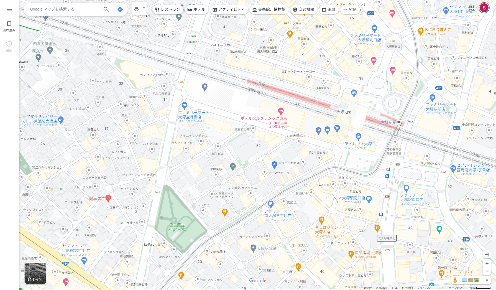
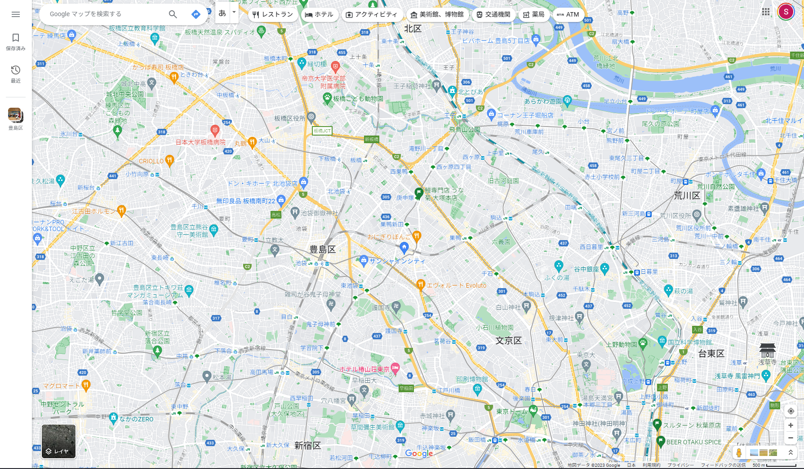
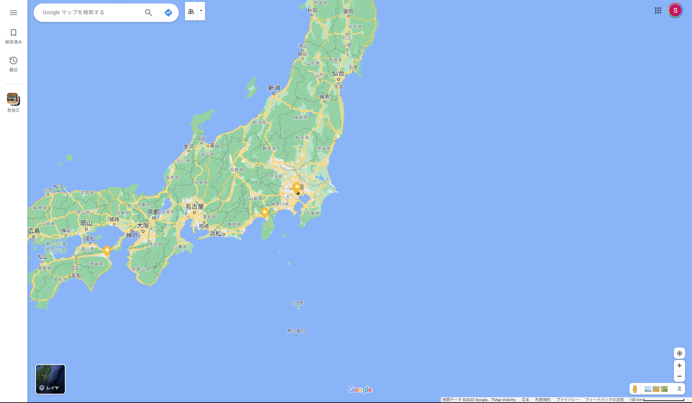

# Topic XX 3D都市モデルを使って全国で使えるシステムを作る

地理情報はさまざまな用途に使うことができます。
しかし、大きな範囲を扱おうとすると現代のコンピューターでも簡単には扱うことができないほどの巨大なデータになります。
そのため、地理情報を適切なアルゴリズムやデータ構造で扱うための多くの研究開発が行われてきました。
PLATEAUの3D都市モデルは、三次元の詳細なデータになったことで、さらに巨大なデータの扱いに気を付けなければならなくなっています。さらに、それに加えて三次元コンピュータグラフィックス特有の最適化なども考慮しなければならなくなっています。
そして、現代ではクラウドなどのオンラインリソースを上手に使ったオンラインのシステムをどのように構築するかという、サーバーやネットワーク特性まで考慮しなければならないケースが増えています。
本トピックでは、これらの一般的な考え方を解説し、いくつか筆者がこれまでに作った事例を取り上げつつ、読者の皆さんの課題解決のヒントになるように説明します。

## 巨大な地理情報の扱い方

まず、地理情報がどのくらい巨大なデータになるかを、実際に調べてみます。

たとえば、地球表面を1㎡に区切った画像データを作るとしましょう。1ピクセルが1㎡になる地球表面の画像データという想定です。衛星写真を思い浮かべるとよいでしょう。

地球の表面積はおおよそ、4×π×6,371㎢=510,049,428,806,000㎡になります。1ピクセルを3バイト(＝RGB各色1バイト)として換算すると、510,049,428,806,000×3=1,530,148,286,418,000バイト≒1.5ペタバイトのデータサイズになります。
これが月ごと週ごとなどで蓄積されることを考えるとなかなかなデータサイズです。

<!-- TODO 数式ちゃんとする -->

一方で、[オープンストリートマップ](https://www.openstreetmap.org/)というプロジェクトが、オープンな汎用地図のベクターデータを作成しています。このオープンストリートマップの[全球データ](https://planet.openstreetmap.org)が、現時点では圧縮されたものでおよそ70GBあります。
ちなみに、PLATEAUの東京都のデータは圧縮ファイルで5.5GBです。PLATEAUの情報量で全球データを作ったとすると相当大きなデータになりそうです。
ベクターデータの方が桁が少ないとはいえ、手元のパソコンで処理するにはちょっと尻込みするレベルの大きさのデータです。
そのため、さまざまなアルゴリズムやデータ構造の工夫で、高速に扱えるようにしていかなければ実用的なシステムを作れません。
本章では、このような巨大な地理情報を扱うときに有効ないくつかの考え方を説明します。PLATEAUの地理情報を使った全国規模のシステムをつくる際のヒントになれば幸いです。

### 局所化をうまくつかう

巨大なデータを扱う時の基本は、データの局在性をうまく使い、そもそも一度に処理するデータの量を減らすことです。
地理情報データの場合、一度に同時に全データを処理しなければならないことはまれです。
注目しているデータ(たとえば今自分がいる場所の周辺)が、地球の裏側のデータを参照しないと処理できないことはほとんどないので、おおよそ注目点の周囲の限定的な範囲のデータを参照するだけで十分なケースがほとんどです。

このようなケースでは、ダウンロードしたりメモリに展開しなければならないデータ量は周辺の狭い範囲のデータだけとなるので、処理量、メモリ使用量などが全体を処理するのに比べて圧倒的に少なく済み、現実的に処理できます。

これは、データ処理だけでなく、表示などでも有効な考え方です。

二次元の地図を表示することを考えた場合、表示している枠の範囲外のデータは基本必要ありません。
また、ゲームエンジンでもFarClipなどのレンダリングする最大距離が決められており、それ以遠のオブジェクトについては描画されません。であれば、全データを用意せずにレンダリングに必要な範囲のデータを用意するだけで問題ないということになります。

このように、処理しなければならないデータの範囲を狭めることは、現実に動作する仕組みを作る際に必須の思考と言えます。
しかし、全体のデータから必要な範囲のデータを検索・抽出するのに時間がかかってしまったりすると本末転倒になります。

### 分割をうまくつかう

そこで次に考慮するのが、データの分割です。
都度全データから検索・抽出するのではなく、あらかじめデータ全体を適切な範囲に分割しておいて、分割単位ごとに処理する考え方です。

もっとも簡単な分割はグリッドです。全データ範囲を格子状に区切り任意の座標からその所属する升目を計算できるようにする仕組みです。簡単な例を示します。

例として100㎞×100kmの地域を対象とするとします。
これを1km四方のグリッドで区切り、処理単位とします。
座標系は図の通りです。

TODO 図

ここで、任意の座標から所属するグリッドを求めるプログラムを書くと以下のようになります。

```
def grid(int x, int y):
    return ((int)(x/100),(int)(y/100))
```
TODO プログラム精査　Pythonでいい？C#とかにしようか？

また、この仕組みだと境界条件さえきちんと考慮すれば隣接グリッドを求めるのも簡単です。

この例では単純な平面上の分割を取り上げましたが、実際には地球が球体であることの考慮や基本とする座標系をどうするかなど、考え方や用途によってさまざまな分割が考えられます。
矩形ではなく、六角形を用いた分割なども提案されています。

### 階層化をうまくつかう

しかし、単純な分割では難しいユースケースがあります。
地図がズームする場合はどうしたらよいでしょうか。

ズームするということはどんどん縮小（離れた視点に）していくと、結局広範囲を扱わなければならなくなり、結果大量のグリッドを処理しなければならなくなり、前節のように単純に分割しただけでは破綻します。

ここで使われるのが、階層化の考え方です。

Google Mapsなどで、拡大縮小していると地図の雰囲気が切り替わるのをご存じでしょうか。





これは、ズームのレベルごとに異なるデータを表示しているからです。
ピラミッドデータ構造というような名前でも呼ばれこともありますが、
データを階層的に管理し、上の階層は下の階層のデータをまとめたデータを持つようなデータ構造になっていて、
縮尺に合わせて適切な階層のデータを表示しています。
また、各階層のデータはその階層に適した粒度で簡略化したりすることで、どのズームレベルのデータでもクライアントが扱えるデータ量に収まるように調整されています。

このように階層化することで、縮尺を変えた場合でも計算量をあまり変えずに処理や描画ができます。
また、データ構造を工夫することでデータが存在しない場所のデータ量を削減できます。

TODO 図　データがないところを高い階層で止めてデータ量を節約する

3Dコンピュータグラフィックスにおいても階層化をLODの異なるデータととらえることで、視点に近い部分は詳細モデルを使い、遠い部分で簡略化したモデルを使うなど、有効に使うことができます。

```
※※※　LODという言葉について　※※※
LOD（Level of Detail）という言葉は近い意味としてPLATEAUのコンテキストとゲームエンジンのコンテキストの両方で使われています。

しかし、両者は明確に違うコンテキストで使われているので注意が必要です。

どちらも詳細度という基本の意味は同じですが、PLATEAUではデータが記述している内容の詳細度を表します。LODレベルが上がるごとにより詳細なデータが追加されていきます。
一方でゲームエンジンのコンテキストでは、見た目をなるべく維持しながら遠くのものは簡略化して表示するという考え方で使われます。LODレベルが上がるごとに、元のモデルから簡略化されたモデルとなります。しかし、PLATEAUのLODと違い、データは簡略化されるだけで要素は増減しません。

LODという言葉が出たときはどちらのコンテキストで使われているか注意して読んでください。
```

### 空間分割

ここまでの分割と階層化の両方をうまく使って、空間全体を分割していくと処理の効率化ができます。
以下によく使われる空間分割の方法を挙げます。
もちろん、用途によって適するもの適さないものがあるので、性質をよく理解して使うことが重要です。

空間分割は、特性や用途によりさまざまな方法があります。
考慮すべきポイントとして、データ構造の更新の頻度や負荷要件、メモリ使用量、各種検索における計算量などになります。

以下に、よく使われる空間分割を簡単に解説します。

Quadtree・Octree
kd-tree
R-tree
BSP
BVH

### 空間インデックス

空間分割を使うと、地物の検索なども効率化できます。
地理空間データベースなどでこのために構築されるデータ構造を空間インデックスと呼びます。
一般的なリレーショナルデータベースシステムでは、データの検索クエリの高速化のためにインデックスというデータ構造が作られます。
よく使われるものに、B-Treeやその変種のデータ構造があり、データベースシステムの利用に必須の仕組みとなっています。
しかし、一般的な行と列で構成されるデータベースで使われるインデックスのアルゴリズムは地理情報の検索には向きません。そのため、地理情報検索に向いた空間インデックスが考案され実装されています。

PostgreSQLの地理情報拡張であるPostGISの場合、R-Treeの空間インデックスを使うことができます。

モートンオーダー　Z階数曲線の話　KVSなどで有利

### 空間ID

空間分割や空間インデックスのデータ構造をもとにして計算されたIDをつかった空間IDという考え方があります。
空間IDの考え方を使うと、地理的な位置を一意のIDで表しデータと紐付けることができます。

XYZタイル
Google MapsのWebメルカトルやデジ庁の空間IDにつなげる
What3words　https://what3words.com/ja/about
ジオハッシュ

### クラウドの活用

現代ではオンラインサービスにおいてクラウドを有効に活用することが一般的です。
巨大な地理情報データを扱う場合、都度データをサーバー側のプログラムで計算して配信すると、処理負荷が大きくなります。
そのため、あらかじめ処理してキャッシュしておいたファイル単位で配信することが多くなります。
その際に選択肢にあがるのがオブジェクトストレージです。AWSのS3やGCPのCloud Storageなどがあります。
また、CDN（Contents Delivery Network）の使用も重要です。
近年、これらのクラウドを基盤とした配信システムに最適化したファイル形式も登場してきました。


Cesiumの3DTilesとPMTilesなどの話
COPC　Cloud Optimized Point Cloud
いかに効率よくデータを配信するか
キャッシュ戦略

S3などのオブジェクトストレージの活用

### データの圧縮

圧縮アルゴリズムは巨大なデータを扱うときに非常に強力な武器となります。公開されている地理情報データは、データの相互利用のために汎用的な読みやすいフォーマットで配布されていることが多く、それらのフォーマットは一般的にはデータ容量が大きくなりがちな冗長なフォーマットになっています。そのため、実際に使うデータをどう圧縮するかが重要になってきます。

たとえば、PLATEAUのCityGMLデータはテキストの非常に冗長なデータとなっているため、かなり大きな容量となっています。
意味的に同じデータを、ProtocolBufferなどの事前に構造を定義したバイナリ形式で保存すると大幅に容量を削減できます。
また、データ形式をバイナリ形式にすることで、読み込み時のパースの処理などを高速化などの利点もあります。

他にも、属性データの部分をSQLiteなどのファイルベースのデータベースに変換すると、検索が容易になります。

一方で3Dモデルのジオメトリの圧縮に使えるのが、Dracoという圧縮フォーマットです。テキストをベースとしたOBJや、複雑なFBXと比べると、ファイルサイズと読み込み速度で利点があります。

また、テクスチャをゲームエンジンで扱う場合には、JPEGやPNGなどの一般的な画像圧縮形式ではなく、DXTCやASTCのようなGPU専用のテクスチャ圧縮形式を使った方が効率的です。
しかし、GPUごとに扱うことのできる形式が異なっている場合が多いため、配信用の形式とするには課題があります。
近年、BasisUという中間形式にすることで、複数のテクスチャ圧縮形式にクライアント側で容易に変換可能なフォーマットが提案されており、利用が進むことが期待されます。

どちらにしろ、使う目的に合わせて最適化したデータ形式を使うことで、多くのメリットがあります。PLATEAUを使ったシステムを構築する際に、こうした最適化した専用データ構造を検討することは一考の価値があると思います。

<!-- 
モデルデータ・点群データの圧縮　Draco
テクスチャデータの圧縮　BasisU
　GPU用のデータ圧縮重要

バイナリーデータ　ProtocolBufferとか
専用のデータ構造を作るのを恐れない方がいい
　専用のデータ構造を作ってもCesiumみたいにフォーマットを公開すればいい

大規模に広範囲でやるとき
課題
空間ID
空間分割
クラウドの活用
　オブジェクトストレージの性質の考慮
　オンラインでデータを持つときに気を付けたいこと
　負荷分散とか、階層構造とか、いろいろいろいろ
-->

## 無限PLATEAUの仕組み詳解

「無限PLATEAU」は著者が構築したPLATEAUの3D都市モデルデータのWeb配信システムです。
公開されているPLATEAUのデータの中から建築物のCityGMLのデータをもとにして、LOD0の平面形状と高さを抽出し、軽量な3D形式に変換してWeb配信するシステムです。
これにより、あらかじめモデルデータをアプリ内に入れておかなくても「PLATEAUのあるところならどこでもランタイムにオンラインでモデルが表示される」＝「無限にPLATEAUが表示され続ける」ということで、「無限PLATEAU」と名付けています。
あらかじめすべてのデータを変換しておくことで、ランタイムでの軽量高速な動作を実現しています。

本項では、この仕組みを簡単に解説します。
なお、より詳細な仕組みについては、筆者の所属する株式会社ホロラボの有志で作成した[「ホロらぼん Vol.01」](https://techbookfest.org/product/rvNpgkshrmF5HBS3SCADFQ)の第1章をご参照ください。

### 無限PLATEAUのデータ処理と空間分割について

まず無限PLATEAUを作るにあたり採用した空間分割を説明します。
無限PLATEAUでは、前項で説明した空間分割の中で一番シンプルなパターンである1レベルのグリッドを採用しました。
これは、ARなどで実際にその場にいるときにその場の3D都市モデルを歩行者視点で表示することを目的にしていたため、複数のズームレベルに対応する階層化の必要がなかったことからの選択です。また検索も自分がいるまさにその地点のグリッドを計算できればよいため、範囲の検索など複雑な処理が必要ないため、空間インデックスなども必要としないという判断です。


### データ圧縮

無限PLATEAUでは、Googleの開発した[Draco](https://google.github.io/draco/)という3Dデータ圧縮を使っています。Draco圧縮は点群や3Dモデルのデータを劇的に圧縮できるデータフォーマットです。非可逆圧縮で圧縮率もモデルに依存しますが、モデルによっては1/10以下のサイズに圧縮されます。
Draco形式への変換は、Googleが公開している[コマンドラインツール](https://github.com/google/draco#encoding-tool)を使います。対応データ形式は、OBJ、STLとPLYです。

無限PLATEAUでは、CityGMLから建物ごとにジオメトリを切り出し、建物ごとの重心に基づいてグリッドに分割しています。
その後、CityGMLの座標からグリッドの中心を原点とする座標系に変換したうえでジオメトリをOBJファイルに書き出します。
それを、前述のDracoのコマンドラインツールを使い、Draco形式に保存して配信用のデータファイルとしています。

### URL設計

二桁ずつ区切って入れ子にした意図
Webサーバーで運用することを想定すると、ひとつのフォルダーに大量のファイルを置けないので、うまく分散するような構造を考えた

### グリッド移動判定の工夫

空間コードというひとつの数字を作り、それとのイコール判定でグリッドの移動を判定


無限PLATEAUの紹介
ほろらぼんで書いたのを、うまくまとめる。

## スケールする地理情報システムでアプリを作る

Orthoverseは、PLATEAUデータを活用したARコンテンツの配信システムです。
Etheriumのコントラクト（いわゆるNFT）として空間IDとURLを紐付ける仕組みを構築し、ある場所にURLが紐付くようになっています。
URLはコンテンツ配信の仕組みとなっており、クライアントアプリはGeospatialAPIにより特定した現在位置からその場所のコンテンツをロードし、ARで表示します。

本項では、この場所とコンテンツを紐付ける仕組みについて解説します。

### 空間IDの設計について

### KVSで空間情報を管理する仕組みについて

### コンテンツの配信の仕組みについて


Orthoverseの紹介
空間インデックス的なKVSの使い方と有効性の説明


